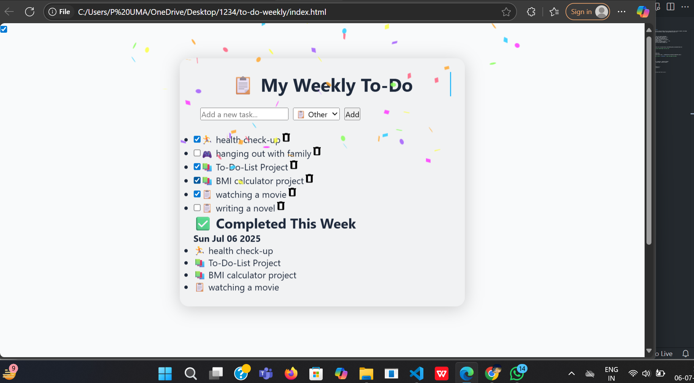

# 📝 Animated To-Do List

A beautifully animated and mobile-friendly To-Do List web app that lets you add, complete, and manage tasks with fun effects like confetti, sounds, dark/light mode, and more! 🎉✨

---

## 🌟 Features

- ✅ Add & complete tasks with smooth animations
- 🧠 Weekly completed task tracker (with confetti!)
- 💡 Dark/Light mode toggle with transition
- 🔊 Task delete with sound + slide-out animation
- 📦 LocalStorage support (tasks stay after refresh!)
- ✨ Floating glassmorphism design
- 🧩 Task types with emojis (📚 Study, 🏃 Health, 🎮 Fun)
- 🕹️ Typewriter heading & floating animation
- 📱 Fully responsive — works great on mobile too!

---

## 🚀 Live Demo

👉 [**Click Here to View the Live App**](https://shailu0720.github.io/animated-todo-list)

---

## 📸 Screenshots

| Task View | Completed View |
|-----------|----------------|
|  |  |

---

## Tech Used

- HTML5  
- CSS3 (Glassmorphism, animations, responsive design)  
- JavaScript (DOM, LocalStorage, confetti effects)

---

## Author

Made with love💖 by P SHAILAJA💫  
 

---

## 📃 License

This project is open-source and free to use 
